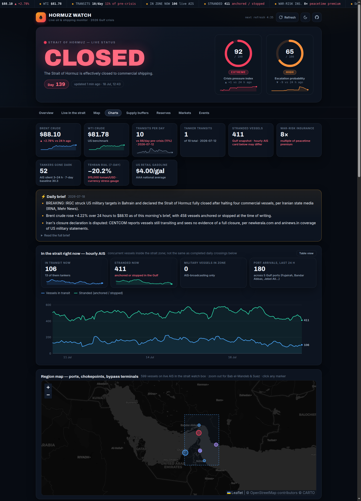
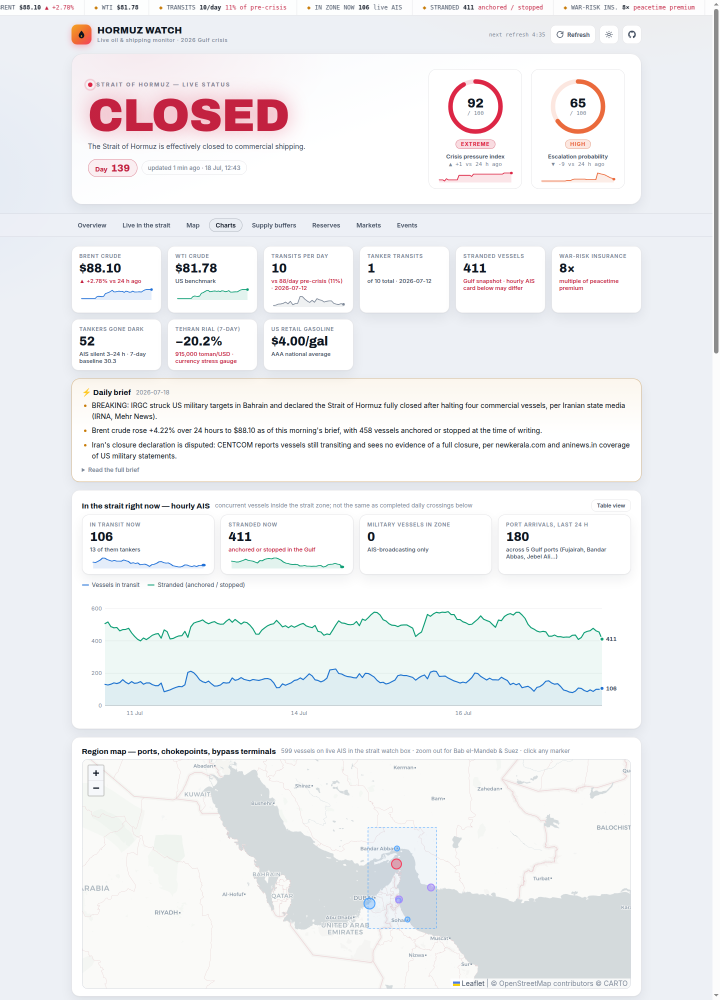
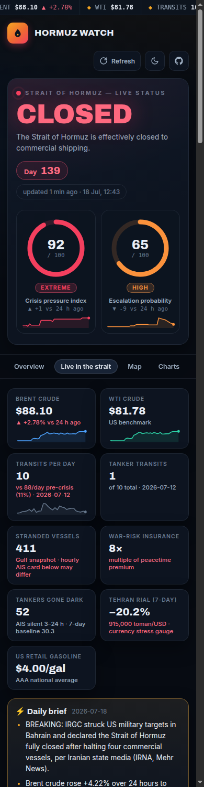

# Hormuz Watch

**Live at: https://supamanluva.github.io/hormuz-watch/**

Dashboard tracking oil prices and shipping through the Strait of Hormuz
during the 2026 US/Israel–Iran war. Roughly 20% of global oil transits the
strait; it has been effectively closed to commercial shipping since 2026-02-28.



<details><summary>More screenshots (light theme, mobile)</summary>




</details>

## What it shows

- **Hero status banner** — is the strait open or closed, day counter since
  closure, plus ring gauges for the straits.live crisis-pressure and
  escalation-probability indices (with 7-day sparklines)
- **Live stats ticker** — scrolling key figures across the top of the page
- **Stat tiles with sparklines** — Brent & WTI price (24 h change, 7-day
  trend), daily transits vs the pre-crisis baseline of ~88 ships/day, tanker
  count, stranded vessels, war-risk insurance multiple, dark tankers,
  Tehran rial, US gasoline
- **Daily brief** — the day's key developments at a glance
- **Live AIS card** — vessels in transit / stranded right now, hourly history
- **Region map** — ports, chokepoints, bypass-pipeline terminals (Leaflet)
- **Oil price chart** — Brent + WTI intraday history (Yahoo Finance / EIA),
  annotated with key war events
- **Daily transits chart** — tankers vs other cargo per day (IMF PortWatch),
  with the pre-crisis median as a reference line
- **Global chokepoints** — where the rerouted traffic went
- **Supply buffers** — US Strategic Petroleum Reserve & Cushing stocks
  (EIA weekly) and Hormuz-bypass pipeline utilization
- **Strategic reserves** — major holders compared, with trade-impact tiles
- **Prediction markets** — Polymarket/Kalshi odds on war outcomes
- **Oil price pressure gauge** — composite 0–100 indicator of upward price
  pressure (transits, Brent momentum, weekly inventory draws, COT positioning,
  Polymarket oil thresholds, strike-report volume, US–Iran rhetoric tone)
- **Oil fundamentals** — weekly US crude/Cushing/SPR stock changes, Brent–WTI
  spread, speculative net positioning, DXY-style USD proxy
- **Live AIS presence** — hourly vessel counts inside the Hormuz and
  Bab el-Mandeb boxes (aisstream.io, collected by the repo poller)
- **Political signals** — White House, Trump (Truth Social), IAEA, UN, OFAC
  sanctions, IRNA and Al Jazeera items, keyword-tagged and filterable
- **Container carrier posture** — who suspended, who's rerouting, TEU trapped
- **Events feed** — strikes, ship attacks, closure/negotiation news
  (GDELT + curated, 15-min refresh), filterable by severity

Core status data is fetched by the visitor's browser straight from the
CORS-open straits.live API. Additional keyless sources (CFTC, Polymarket,
Frankfurter FX) are also fetched browser-side; sources a browser cannot
reach cross-origin (RSS feeds, GDELT, aisstream.io websockets) are polled
server-side by a GitHub Action and committed to `data/`, so the published
page is always current — no backend, no rebuilds.

## Design & UX

- Dark-first "war room" theme with a light/dark toggle (persisted in
  `localStorage`), Archivo/Inter typography, custom SVG charts (no chart
  library), and a Leaflet map whose tiles follow the theme
- Sticky section nav with scroll-spy, auto-refresh countdown, manual refresh
  button, back-to-top button, and a "copy status summary" button
- Fully responsive: 2-column tiles, horizontally scrolling nav and tables on
  phones; honors `prefers-reduced-motion`

## Run it

```sh
cd ~/hormuz-watch
python3 -m http.server 8181
# open http://localhost:8181
```

Tiles refresh every 60 s, charts every 5 min (polling pauses in hidden tabs).
Time-range buttons (7/30/90 days/All) scope both charts; each chart has a
table view.

## Data source

Everything comes from the free tier of the [straits.live API](https://straits.live/api)
(CORS-open, no key), which aggregates:

- **IMF PortWatch** chokepoint 6 — daily AIS-derived transit counts
  (publishes with ~1 week lag)
- **Yahoo Finance / EIA** — Brent & WTI prices
- **GDELT + curated** — war/diplomacy events

Plus, for the trigger-monitoring layer:

- **CFTC COT** (Socrata), **Polymarket Gamma**, **Frankfurter** (ECB FX) —
  keyless and CORS-open, fetched browser-side
- **EIA API v2** — weekly stocks (crude/Cushing/SPR); needs a free key
  pasted into `EIA_KEY` at the top of the script in `index.html`
  ([register here](https://www.eia.gov/opendata/register.php)).
  Note: EIA discontinued its futures-settlements route in April 2024, so no
  free term-structure feed exists — the pressure gauge uses weekly inventory
  draws as the supply-tightness leg instead.
- **NASA FIRMS** — VIIRS fire detections near high-value energy sites
  (refineries/terminals), shown on the map; free key into `FIRMS_KEY`
  ([get one here](https://firms.modaps.eosdis.nasa.gov/api/map_key/))
- **Repo poller** (`poller.py` + `.github/workflows/poll-feeds.yml`, every
  ~20 min) collects what browsers can't fetch cross-origin and commits it to
  `data/`: political RSS feeds → `feeds.json`, GDELT tone/strike volume →
  `gdelt.json`, aisstream.io live AIS → `ais_transits.json` (needs an
  `AISSTREAM_KEY` repo secret; without it the AIS step skips cleanly)

## History archive

Some feeds only retain limited history. `logger.py` (stdlib only) appends the
daily one-row status snapshot to `history/status_history.csv` and mirrors the
full-history oil/transit/event CSVs.

A GitHub Action (`.github/workflows/log-history.yml`) runs it daily at
10:20 UTC and commits the result, so the archive builds itself in this repo.
It can also be run locally: `python3 logger.py` (or via cron).

## Reserves & countdown notes

- The **US SPR runway** tile is a naive linear projection: current level ÷
  average draw rate over the last 4 weeks (EIA weekly data). Real drawdowns
  are rate-limited and the SPR would never be run to literal zero.
- Non-US reserve figures are curated EIA/IEA estimates (see dates on each
  row) and pre-date the March 2026 IEA coordinated release; only the US
  publishes weekly official data.

## Ideas / next steps

- Correlate transit count vs Brent (lagged) once enough history accumulates
- Alerting: notify when Brent moves > X% or transits fall below a threshold
  (straits.live also has RSS: `/feed.xml`, `/status/feed.xml`)
- Premium endpoints exist (per-vessel AIS manifests, $0.01–0.25 via x402)
  if you ever want ship-level data
